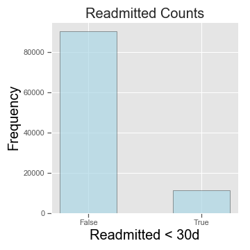
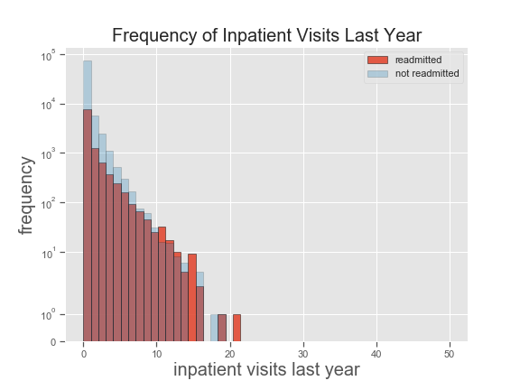

# Predicting_Hospital_Readmissions
by Claudio Staub

##### Table of Contents
    - [Feature Engineering](https://www.github.com/clstaub/Predicting_Hospital_Readmissions#feature-engineering)

## Introduction
With estimated costs in the order of tens of billions per annum, hospital readmissions impose a significant financial burden on health care institutions across the nation. Up until more recent times, there was not a lot of incentive for Hospitals to reduce these readmissions. When Center for Medicares and Medicaid Services began public reporting hospital readmission rates, the ethical and professional incentive was there, but hospitals that aimed to reduce readmissions were losing revenue unless they could fill their beds. Enter the Hospital Readmissions Reduction Program (HRRP) circa 2013 which provided financial incentive for Hospitals to reduce readmissions. 

This has still proven to be a difficult task but hospitals are employing a number of strategies to reduce the preventable readmissions. Progress has been made since the implementation of the HRRP but estimates of readmissions that could have been prevented are still as high as 70%. It is therefore in their best interest to find ways to further reduce this undesirable outcome. 

## Strategy

- Data Preprocessing
- Exploratory Data Analysis
- Hypothesis Testing

## Data Overview

The data set was made available by Virgina Commonwealth University via the UCI Machine Learning Repository and can be found [here](https://archive.ics.uci.edu/ml/datasets/diabetes+130-us+hospitals+for+years+1999-2008).

- It contains 101766 observations with 50 different features. 
- Features are largely categorical variables

#### Main feature categories:
- Basic demographics: Encounter ID, Patient #, Race, Gender, Age, Weight
- Medical Hx: Medications, # of Procedures, # Medications, 

## Data Preprocessing

The metric of interest that labels whether a patient was readmitted or not has three possible values: 

- **<30** : Patients that were readmitted in less than thirty days. 
- **>30** : Paitents that were readmitted in greater than thirty days. 
- **NO** : Patients that were not readmitted

The metric of concern according to the HRRP is patients that were readmitted in less than thirty days. Therefore we will rename the column to 'readmitted_<30d' and combine the '>30' and 'NO'.

Below is the proportion of patients in the dataset that were readmitted. The key take-away here is that we are dealing with an imbalanced data set. This will need to be take into account later when we start working on the predictive model. Options to work around this include the following which will be discussed in more detail and demonstrated later. 
- Synthetically oversampling the minority class (SMOTE)
- Undersampling the majority class 

Taking a cursory glance at the data showed that a '?' was used where values were unknown. To address this, we will replace all '?' with np.nan. This will paint a more honest picture of any missing values. 

- Column 'weight' is missing 96.86% of data
- Column 'payer_code' is missing 39.56% of data
- Column 'medical_specialty' is missing 49.08% of data

**What do we do with the columns containing missing data?**

- Since weight is missing ~97% of data, we will drop the column. It would have been a nice feature to evaluate. 
- Additionally, payer_code and medical_specialty are missing ~40 and ~50 % of data respectively. Although there are other ways to deal with this, we will remove the columns. 

A good next step would be to evaluate the unique values that each feature contains. If the feature contains a large amount of values (i.e. Patient ID, encounter ID) we will just take a count of the unique values in the column.

Since 'examide' and 'citoglipton' only contain one unique value, we will drop these two features from the data frame. 

Another column that needed cleaning was the **discharge_disposition_id** column. This column along with **admission_type_id** and **admission_source_id** all contained numerical values. These numeric values only served as identifiers and didn't actually have any ordered meaning. The id translations were provided in a separate csv file 'IDs_mapping.csv'.  

Reviewing admission_type_id table there seem to be some redundancies in the unique values. We can group some of these together to simplify interpretability when we get to Modeling as these could be important features. Will consolidate 'Urgent' and 'Trauma Center' with 'Emergency'. Will also combine 'Not Mapped' and 'NaN' into 'Not Available'.

Similar logic can be applied to the discharge_disposition_id as well as the admission_source_id

Furthermore, there are some observations with discharge_disposition_id that will need to be removed from the main df altogether. After consideration, we will remove records that have a discharge_disposition_id that pertains to a patient that has expired or was discharged and transferred to hospice care--reason being that they shouldn't be counted in the group that wasn't readmitted as this would misrepresent that population.

Based on these criteria, we will remove records where
discharge_disposition_id = 11,13,14,18,19,20,21

## Exploratory Data Analysis
It is worth exploring if any of the numeric variables have any correlations. We will write a function to exract numeric columns from a data frame of choice and return a numeric data frame. This will be performed for both the 

Extraction of numeric columns and plotting in a pairplot did not yield any strong correlations. The columns with integer values did not provide a lot of insight. 

We should also evaluate if the distributions of the continuous variables have any predictive power in classifying readmitted vs. non-readmitted patients. 

Reviewing the histograms, we can not appreciate any predictive power in these variables. 

A good next step would be to evaluate the unique values that each feature contains. If the feature contains a large amount of values (i.e. Patient ID, encounter ID) we will just take a count of the unique values in the column.

## Hypothesis Testing

Since the columns in this dataset are largely categorical variables, we want to test some of these for indepence. 

As there are various mechanisms of action by which diabetes medication can treat the disease, there are many medications on the market. This can be seen by the 23 various diabetes medications that are included in this data set. Finding the optimal medication for each patient can often be an exercise of trial and error. Adverse side-effects secondary to a medication change often result in hospitalization as patients need to be monitored with serial blood glucose tests. 

Let's test the change in medication column and the readmission column for independence. Since these both only contain two possible values, this would be a fairly straight forward Chi-Squared test. 

#### State Null and Alternative Hypothesis

>$H_0$:Change in Medicine and Readmission are independent variables

>$H_A$:They are not independent

#### Assumptions

- When testing the data, the cells should be counts of cases and not percentages. It is okay to convert to percentages after testing the data
- The levels (groups) of the variables being tested are mutually exclusive
- Each participant contributes to only one cell within the Chi-square table
- The groups being tested must be independent
- The value of expected cells should be greater than 5 for at least 20% of the cells

#### Results
A Chi-Squared test result of 38.5 with 1 degree of freedom yields a p-value of 5.37 * e-10, which means reject the Null Hypothesis. Changes in medicine and hospital readmissions are not independent. Further Post-Hoc Analysis can be performed. 

## Feature Engineering
Due to the imbalanced nature of this data set, we will need to implement some oversampling or undersampling techniques. A tried and tested method is Synthetic Minority Oversampling Technique (SMOTE).  This technique draws lines between the existing minority cluster via KNN and generates data points on those lines until the dataset is balanced. 
An example of an undersampling technique is NearMiss. This technique undersamples the majority class so that the two classes are equal in size. The trade-off with this is the potential loss of data but we reduce the risk of overfitting our model to the data. 